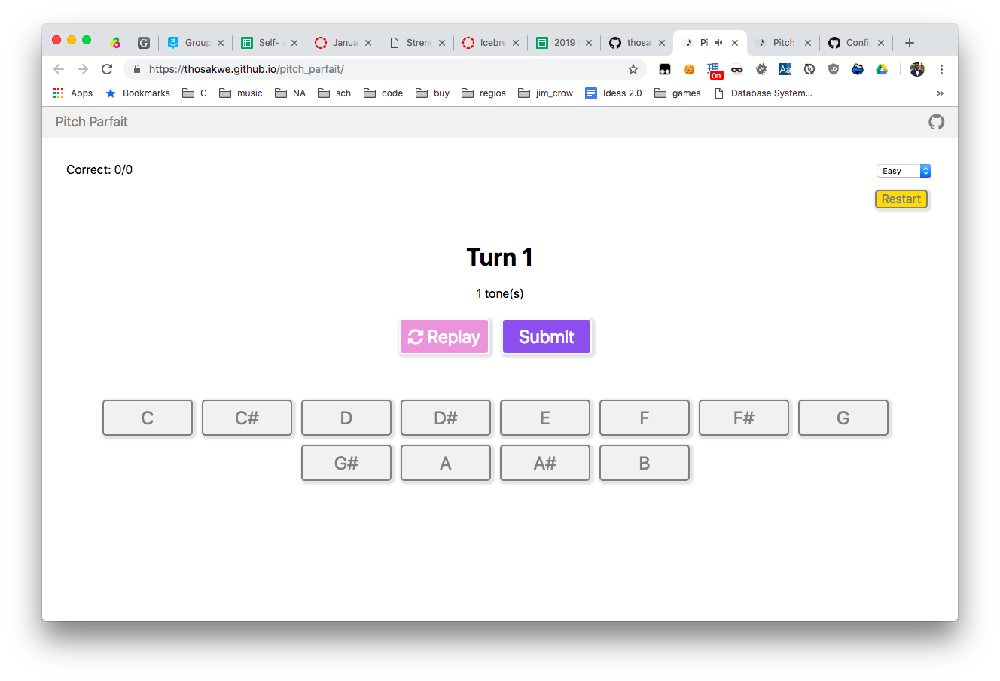

# pitch_parfait
Perfect pitch test/trainer. (PWA)

## About
Pitch Parfait is a Web app designed to test whether
you have "perfect pitch," and to train you to
recognize notes, if you believe you have it.

## Usage
1. Hit the "Start" button!
2. A tone will be played. Click the button that
corresponds to it.
3. If you answer incorrectly, an alert will pop up telling you which note it was.
4. Repeat until your heart is content.

Different levels of difficulty will play different
numbers of tones simultaneously.
